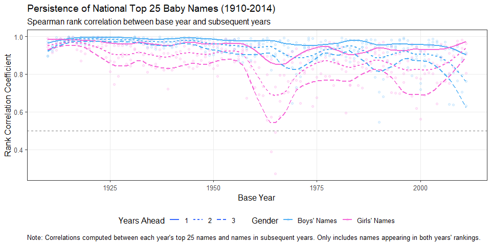
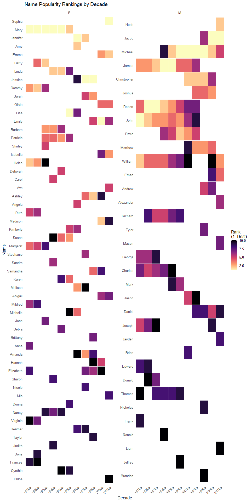
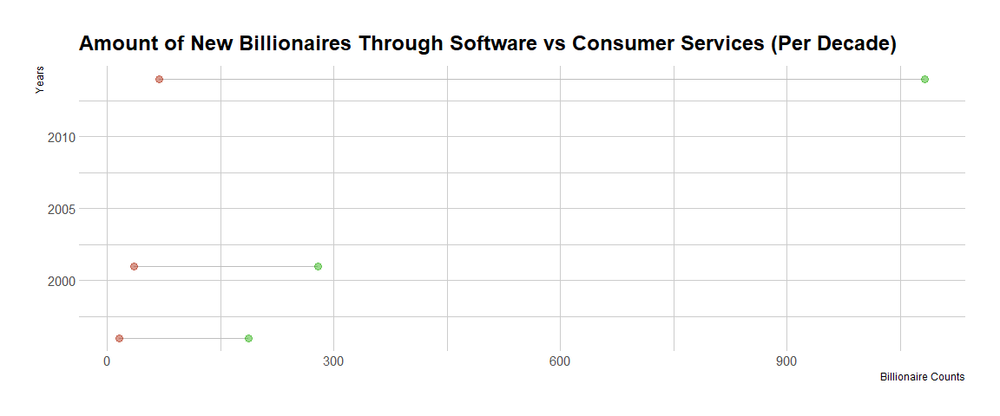
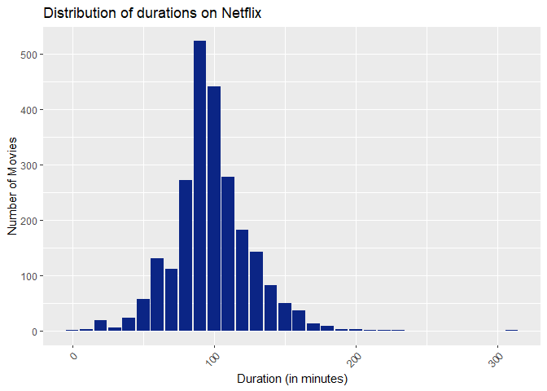
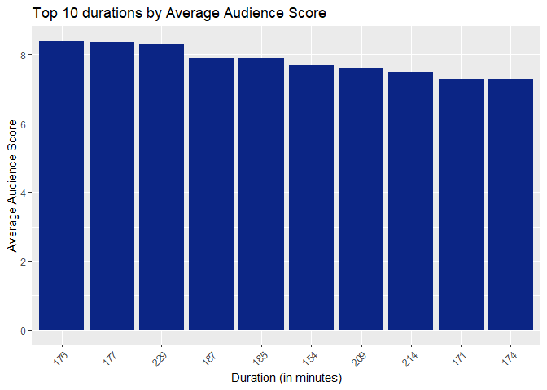
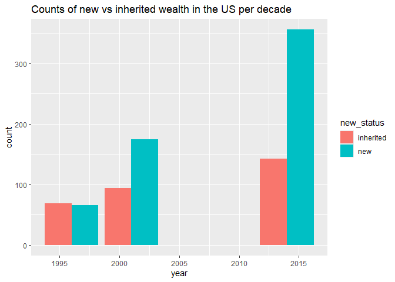
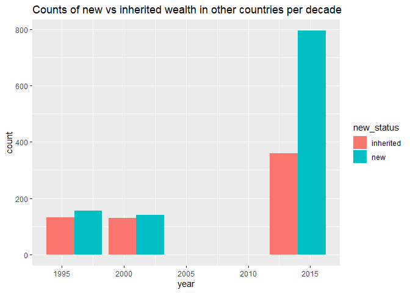

# PURPOSE:

This readme is located in my repository for the Data Science Methods for
Economics and Finance 871 Exam. The repository contains all of my code,
figures, tables, and write-ups for the exam. There are a total of 5
questions & each question has its own folder with an accompanying
Readme, code and data folder.

# SETUP CREATION:

``` r
#The '23761067' project was created by copying the file path for my repository file (C:/Users/Talyah Greyling/Documents/1) Meesters/1) Data Science 871/Data_Science_Exam_23761067_GitHub) and then using fmxdat::make_project(ProjNam = "23761067"). 

#This code was used to create the question folders: 
location <- "C:/Users/Talyah Greyling/Documents/1) Meesters/1) Data Science 871/Data_Science_Exam_23761067_GitHub"
Texevier::create_template(directory = location, template_name = "Question1")
Texevier::create_template(directory = location, template_name = "Question2")
Texevier::create_template(directory = location, template_name = "Question3")
Texevier::create_template(directory = location, template_name = "Question4")
Texevier::create_template(directory = location, template_name = "Question5")
```

# DATA STORAGE:

I unzipped the data folder provided (datsci.nfkatzke.com/PracData25.zip)
and put each data file in its respective question folder’s corresponding
data file. I then added ’\*data/’ to my gitignore to prevent the data
folders from committing to GitHub.

I also stored the ‘Practical_25.pdf’ in my bin folder.

# CODE USED FOR FIGURES AND TABLES:

``` r
# Housekeeping 
knitr::opts_chunk$set(echo = FALSE, message = FALSE, warning = FALSE, fig.width = 6, fig.height = 5, fig.pos = 'H') # set chunk defaults 
rm(list = ls()) # clear environment 
gc() # garbage collection 
```

    ##           used (Mb) gc trigger (Mb) max used (Mb)
    ## Ncells  556731 29.8    1239635 66.3   702048 37.5
    ## Vcells 1060576  8.1    8388608 64.0  1927558 14.8

``` r
options(scipen = 999) #suppress scientific notation
options(dplyr.summarise.inform=F) # suppress messages

# Load neccessary libraries 
pacman::p_load(dplyr, ggplot2, tidyverse, stringr, purrr, lubridate, gt, fmsb, hrbrthemes, knitr) ############## update 

# Source in all functions: 
list.files('Question1/code/', full.names = T, recursive = T) %>% .[grepl('.R', .)] %>% as.list() %>% walk(~source(.))
list.files('Question2/code/', full.names = T, recursive = T) %>% .[grepl('.R', .)] %>% as.list() %>% walk(~source(.))
list.files('Question3/code/', full.names = T, recursive = T) %>% .[grepl('.R', .)] %>% as.list() %>% walk(~source(.))
list.files('Question4/code/', full.names = T, recursive = T) %>% .[grepl('.R', .)] %>% as.list() %>% walk(~source(.))
list.files('Question5/code/', full.names = T, recursive = T) %>% .[grepl('.R', .)] %>% as.list() %>% walk(~source(.))
```

# QUESTION 1: Baby Names

## Load data

## Process explained

-   Wrote the introduction
-   I decided to look at naming trends nationally for the US since this
    was in line with the clients request to start by showing a
    time-series representation of the Spearman rank-correlation between
    each year’s 25 most popular boys’ and girls’ names and that of the
    next 3 years and meant that wrangling work was already done in this
    format.
-   Created the function ‘top_n_names’ that takes ‘n’ as an input and
    filters the top 25 names (by frequency) per year & gender
    combination and used it to create ‘top_names’
-   Created the function ‘calculate_correlations’ that takes
    ‘top_names’, ‘target_year’ and ‘future_years’ as an input and
    calculates the Spearman correlation between a year and its future
    years
-   Created the function ‘name_persistence’ that takes ‘top_names’ and
    ‘future_years’ as an input and applies the above mentioned
    correlation analysis to all years
-   Created the function ‘plot_name_persistence’ that takes
    ‘corr_results’, ‘gender_colors’ and ‘smooth_span’ as inputs and
    create a smooth line graph of the persistence of national top 25
    baby names (1910-2014) using the Spearman rank correlation between
    base year and subsequent years
-   Drew ‘PersistPlot’ and summarised my insights from the graph in
    bullet points
-   After this requested initial rank-correlation analysis it would be
    useful to see which names were the most popular
-   To look at name popularity I decided to look at the top 5 nationally
    per year for boys and girls respectively, but upon time series
    visualisation saw that the persistence was too weak over the while
    time series to generate useful plots. I therefore decided to
    identify the top 10 names per decade and visualise those in a heat
    map.
-   Used function ‘top_n_names’ to create ‘pop_names’
-   Created the function ‘top_n_names_per_decade’ that takes ‘pop_names’
    and ‘top_n’ as inputs and filters the top 25 names per decade &
    gender combination and used this to create ‘decade_top_names’
-   Created the function ‘popular_names_heatmap’ that takes ‘decadal_df’
    as an input and creates a heat map plot to display distributions for
    popular names over the decades
-   Drew ‘PopNamesMap’ and summarised my insights from the graph in
    bullet points
-   Next I was interested in knowing if people name babies after famous
    actors/ actresses who play popular movie characters
-   I define popular as a movie that scores above average on TMDB
-   To explore this question I created a function ‘get_popular_movies’
    that take ‘HBO_credits’ and ‘HBO_titles’ as inputs and determines
    which movies got above average TMDB scores
-   I then manually filtered the combined ‘babies_after_actors’ data
    frame and generated two tables ‘female_actors_table’ and
    ‘male_actors_table’ that depict the top 10 baby names per decade are
    related to actors/ actresses’ names from popular movies released
    during that decade
-   I then summarised my insights from the tables in bullet points and
    decided not to generate reproducible plots to reprint to this Readme
    since the results were not of an interesting nature

## Issues encountered

-   I wrote a function to silently collate the rds files, but upon its
    creation saw that many of the columns then became unusable by
    containing an abundance of NAs, I decided to read in each file
    seperately by adapting the code provided in the assignment.

## Plots, graphs and tables reprinted


<p class="caption">
Persistence of National Top 25 Baby Names (1910-2014).
</p>


<p class="caption">
Persistence of National Top 10 Baby Names per decade (1910-2014)
</p>

# QUESTION 2: Music Taste

## Load data

## Process explained

-   Wrote the introduction
-   Wrote context for less avid listeners so that all readers of the
    report can understand its contents.
    -   Includes 2 references
-   Created the function ‘merge_datasets’ that takes ‘df_metallica’ and
    ‘df_coldplay’ as an inputs and merges them to create a single data
    set, ‘df_metcol’
-   Created a list of words that indicate duplicates of a song that has
    already been recorded, ‘duplicate_words’
-   Created the function ‘no_duplicate_words’ that takes ‘col_name’ as
    an input and indicates if any duplicate words are present
-   Used ‘duplicate_words’ and ‘no_duplicate_words’ to filter by the
    ‘name’ and ‘album’ columns in my data set
-   Added a column ‘month_year’ in date format
-   Created the function ‘get_stack_df’ that takes ‘df_metcol_unique’ as
    an input and get summary statistics in long format that I can plot a
    stacked bar graph for both Coldplay and Metallica
-   Created the function ‘draw_table_summary’ that takes
    ‘df_metcol_unique’ as an input and create a table containing basic
    summary stats for both Coldplay and Metallica
-   Drew ‘table_summary’ and commented on the statistics in the section
    “Consistent Popularity, Divergent Paths”
-   Created the function ‘draw_stack’ that takes ‘df_stack’ as an input
    and creates a stacked bar graph of summary statistics for both
    Coldplay and Metallica
-   Drew ‘stack_plot’ and commented on the statistics in the section
    “Comparing Characteristics”
-   Created the function ‘draw_best_albums_table’ that takes
    ‘df_metcol_unique’ as an input and creates a table of summary
    statistics for the best performing albums for both Coldplay and
    Metallica
-   Drew ‘table_best_albums’ and commented on the statistics in the
    section “Comparing top albums”
-   Wrote the conclusion

## Plots, graphs and tables reprinted

<div id="fdxxelexkh" style="padding-left:0px;padding-right:0px;padding-top:10px;padding-bottom:10px;overflow-x:auto;overflow-y:auto;width:auto;height:auto;">
<style>#fdxxelexkh table {
  font-family: system-ui, 'Segoe UI', Roboto, Helvetica, Arial, sans-serif, 'Apple Color Emoji', 'Segoe UI Emoji', 'Segoe UI Symbol', 'Noto Color Emoji';
  -webkit-font-smoothing: antialiased;
  -moz-osx-font-smoothing: grayscale;
}

#fdxxelexkh thead, #fdxxelexkh tbody, #fdxxelexkh tfoot, #fdxxelexkh tr, #fdxxelexkh td, #fdxxelexkh th {
  border-style: none;
}

#fdxxelexkh p {
  margin: 0;
  padding: 0;
}

#fdxxelexkh .gt_table {
  display: table;
  border-collapse: collapse;
  line-height: normal;
  margin-left: auto;
  margin-right: auto;
  color: #333333;
  font-size: 16px;
  font-weight: normal;
  font-style: normal;
  background-color: #FFFFFF;
  width: auto;
  border-top-style: solid;
  border-top-width: 2px;
  border-top-color: #A8A8A8;
  border-right-style: none;
  border-right-width: 2px;
  border-right-color: #D3D3D3;
  border-bottom-style: solid;
  border-bottom-width: 2px;
  border-bottom-color: #A8A8A8;
  border-left-style: none;
  border-left-width: 2px;
  border-left-color: #D3D3D3;
}

#fdxxelexkh .gt_caption {
  padding-top: 4px;
  padding-bottom: 4px;
}

#fdxxelexkh .gt_title {
  color: #333333;
  font-size: 125%;
  font-weight: initial;
  padding-top: 4px;
  padding-bottom: 4px;
  padding-left: 5px;
  padding-right: 5px;
  border-bottom-color: #FFFFFF;
  border-bottom-width: 0;
}

#fdxxelexkh .gt_subtitle {
  color: #333333;
  font-size: 85%;
  font-weight: initial;
  padding-top: 3px;
  padding-bottom: 5px;
  padding-left: 5px;
  padding-right: 5px;
  border-top-color: #FFFFFF;
  border-top-width: 0;
}

#fdxxelexkh .gt_heading {
  background-color: #FFFFFF;
  text-align: center;
  border-bottom-color: #FFFFFF;
  border-left-style: none;
  border-left-width: 1px;
  border-left-color: #D3D3D3;
  border-right-style: none;
  border-right-width: 1px;
  border-right-color: #D3D3D3;
}

#fdxxelexkh .gt_bottom_border {
  border-bottom-style: solid;
  border-bottom-width: 2px;
  border-bottom-color: #D3D3D3;
}

#fdxxelexkh .gt_col_headings {
  border-top-style: solid;
  border-top-width: 2px;
  border-top-color: #D3D3D3;
  border-bottom-style: solid;
  border-bottom-width: 2px;
  border-bottom-color: #D3D3D3;
  border-left-style: none;
  border-left-width: 1px;
  border-left-color: #D3D3D3;
  border-right-style: none;
  border-right-width: 1px;
  border-right-color: #D3D3D3;
}

#fdxxelexkh .gt_col_heading {
  color: #333333;
  background-color: #FFFFFF;
  font-size: 100%;
  font-weight: normal;
  text-transform: inherit;
  border-left-style: none;
  border-left-width: 1px;
  border-left-color: #D3D3D3;
  border-right-style: none;
  border-right-width: 1px;
  border-right-color: #D3D3D3;
  vertical-align: bottom;
  padding-top: 5px;
  padding-bottom: 6px;
  padding-left: 5px;
  padding-right: 5px;
  overflow-x: hidden;
}

#fdxxelexkh .gt_column_spanner_outer {
  color: #333333;
  background-color: #FFFFFF;
  font-size: 100%;
  font-weight: normal;
  text-transform: inherit;
  padding-top: 0;
  padding-bottom: 0;
  padding-left: 4px;
  padding-right: 4px;
}

#fdxxelexkh .gt_column_spanner_outer:first-child {
  padding-left: 0;
}

#fdxxelexkh .gt_column_spanner_outer:last-child {
  padding-right: 0;
}

#fdxxelexkh .gt_column_spanner {
  border-bottom-style: solid;
  border-bottom-width: 2px;
  border-bottom-color: #D3D3D3;
  vertical-align: bottom;
  padding-top: 5px;
  padding-bottom: 5px;
  overflow-x: hidden;
  display: inline-block;
  width: 100%;
}

#fdxxelexkh .gt_spanner_row {
  border-bottom-style: hidden;
}

#fdxxelexkh .gt_group_heading {
  padding-top: 8px;
  padding-bottom: 8px;
  padding-left: 5px;
  padding-right: 5px;
  color: #333333;
  background-color: #FFFFFF;
  font-size: 100%;
  font-weight: initial;
  text-transform: inherit;
  border-top-style: solid;
  border-top-width: 2px;
  border-top-color: #D3D3D3;
  border-bottom-style: solid;
  border-bottom-width: 2px;
  border-bottom-color: #D3D3D3;
  border-left-style: none;
  border-left-width: 1px;
  border-left-color: #D3D3D3;
  border-right-style: none;
  border-right-width: 1px;
  border-right-color: #D3D3D3;
  vertical-align: middle;
  text-align: left;
}

#fdxxelexkh .gt_empty_group_heading {
  padding: 0.5px;
  color: #333333;
  background-color: #FFFFFF;
  font-size: 100%;
  font-weight: initial;
  border-top-style: solid;
  border-top-width: 2px;
  border-top-color: #D3D3D3;
  border-bottom-style: solid;
  border-bottom-width: 2px;
  border-bottom-color: #D3D3D3;
  vertical-align: middle;
}

#fdxxelexkh .gt_from_md > :first-child {
  margin-top: 0;
}

#fdxxelexkh .gt_from_md > :last-child {
  margin-bottom: 0;
}

#fdxxelexkh .gt_row {
  padding-top: 8px;
  padding-bottom: 8px;
  padding-left: 5px;
  padding-right: 5px;
  margin: 10px;
  border-top-style: solid;
  border-top-width: 1px;
  border-top-color: #D3D3D3;
  border-left-style: none;
  border-left-width: 1px;
  border-left-color: #D3D3D3;
  border-right-style: none;
  border-right-width: 1px;
  border-right-color: #D3D3D3;
  vertical-align: middle;
  overflow-x: hidden;
}

#fdxxelexkh .gt_stub {
  color: #333333;
  background-color: #FFFFFF;
  font-size: 100%;
  font-weight: initial;
  text-transform: inherit;
  border-right-style: solid;
  border-right-width: 2px;
  border-right-color: #D3D3D3;
  padding-left: 5px;
  padding-right: 5px;
}

#fdxxelexkh .gt_stub_row_group {
  color: #333333;
  background-color: #FFFFFF;
  font-size: 100%;
  font-weight: initial;
  text-transform: inherit;
  border-right-style: solid;
  border-right-width: 2px;
  border-right-color: #D3D3D3;
  padding-left: 5px;
  padding-right: 5px;
  vertical-align: top;
}

#fdxxelexkh .gt_row_group_first td {
  border-top-width: 2px;
}

#fdxxelexkh .gt_row_group_first th {
  border-top-width: 2px;
}

#fdxxelexkh .gt_summary_row {
  color: #333333;
  background-color: #FFFFFF;
  text-transform: inherit;
  padding-top: 8px;
  padding-bottom: 8px;
  padding-left: 5px;
  padding-right: 5px;
}

#fdxxelexkh .gt_first_summary_row {
  border-top-style: solid;
  border-top-color: #D3D3D3;
}

#fdxxelexkh .gt_first_summary_row.thick {
  border-top-width: 2px;
}

#fdxxelexkh .gt_last_summary_row {
  padding-top: 8px;
  padding-bottom: 8px;
  padding-left: 5px;
  padding-right: 5px;
  border-bottom-style: solid;
  border-bottom-width: 2px;
  border-bottom-color: #D3D3D3;
}

#fdxxelexkh .gt_grand_summary_row {
  color: #333333;
  background-color: #FFFFFF;
  text-transform: inherit;
  padding-top: 8px;
  padding-bottom: 8px;
  padding-left: 5px;
  padding-right: 5px;
}

#fdxxelexkh .gt_first_grand_summary_row {
  padding-top: 8px;
  padding-bottom: 8px;
  padding-left: 5px;
  padding-right: 5px;
  border-top-style: double;
  border-top-width: 6px;
  border-top-color: #D3D3D3;
}

#fdxxelexkh .gt_last_grand_summary_row_top {
  padding-top: 8px;
  padding-bottom: 8px;
  padding-left: 5px;
  padding-right: 5px;
  border-bottom-style: double;
  border-bottom-width: 6px;
  border-bottom-color: #D3D3D3;
}

#fdxxelexkh .gt_striped {
  background-color: rgba(128, 128, 128, 0.05);
}

#fdxxelexkh .gt_table_body {
  border-top-style: solid;
  border-top-width: 2px;
  border-top-color: #D3D3D3;
  border-bottom-style: solid;
  border-bottom-width: 2px;
  border-bottom-color: #D3D3D3;
}

#fdxxelexkh .gt_footnotes {
  color: #333333;
  background-color: #FFFFFF;
  border-bottom-style: none;
  border-bottom-width: 2px;
  border-bottom-color: #D3D3D3;
  border-left-style: none;
  border-left-width: 2px;
  border-left-color: #D3D3D3;
  border-right-style: none;
  border-right-width: 2px;
  border-right-color: #D3D3D3;
}

#fdxxelexkh .gt_footnote {
  margin: 0px;
  font-size: 90%;
  padding-top: 4px;
  padding-bottom: 4px;
  padding-left: 5px;
  padding-right: 5px;
}

#fdxxelexkh .gt_sourcenotes {
  color: #333333;
  background-color: #FFFFFF;
  border-bottom-style: none;
  border-bottom-width: 2px;
  border-bottom-color: #D3D3D3;
  border-left-style: none;
  border-left-width: 2px;
  border-left-color: #D3D3D3;
  border-right-style: none;
  border-right-width: 2px;
  border-right-color: #D3D3D3;
}

#fdxxelexkh .gt_sourcenote {
  font-size: 90%;
  padding-top: 4px;
  padding-bottom: 4px;
  padding-left: 5px;
  padding-right: 5px;
}

#fdxxelexkh .gt_left {
  text-align: left;
}

#fdxxelexkh .gt_center {
  text-align: center;
}

#fdxxelexkh .gt_right {
  text-align: right;
  font-variant-numeric: tabular-nums;
}

#fdxxelexkh .gt_font_normal {
  font-weight: normal;
}

#fdxxelexkh .gt_font_bold {
  font-weight: bold;
}

#fdxxelexkh .gt_font_italic {
  font-style: italic;
}

#fdxxelexkh .gt_super {
  font-size: 65%;
}

#fdxxelexkh .gt_footnote_marks {
  font-size: 75%;
  vertical-align: 0.4em;
  position: initial;
}

#fdxxelexkh .gt_asterisk {
  font-size: 100%;
  vertical-align: 0;
}

#fdxxelexkh .gt_indent_1 {
  text-indent: 5px;
}

#fdxxelexkh .gt_indent_2 {
  text-indent: 10px;
}

#fdxxelexkh .gt_indent_3 {
  text-indent: 15px;
}

#fdxxelexkh .gt_indent_4 {
  text-indent: 20px;
}

#fdxxelexkh .gt_indent_5 {
  text-indent: 25px;
}

#fdxxelexkh .katex-display {
  display: inline-flex !important;
  margin-bottom: 0.75em !important;
}

#fdxxelexkh div.Reactable > div.rt-table > div.rt-thead > div.rt-tr.rt-tr-group-header > div.rt-th-group:after {
  height: 0px !important;
}
</style>
<table class="gt_table" data-quarto-disable-processing="false" data-quarto-bootstrap="false">
  <thead>
    <tr class="gt_heading">
      <td colspan="6" class="gt_heading gt_title gt_font_normal" style>Table 1: Basic Summary Statistics for Coldplay and Metallica Albums</td>
    </tr>
    <tr class="gt_heading">
      <td colspan="6" class="gt_heading gt_subtitle gt_font_normal gt_bottom_border" style>(SD = Standard Deviation)</td>
    </tr>
    <tr class="gt_col_headings">
      <th class="gt_col_heading gt_columns_bottom_border gt_left" rowspan="1" colspan="1" scope="col" id="Band">Band</th>
      <th class="gt_col_heading gt_columns_bottom_border gt_right" rowspan="1" colspan="1" scope="col" id="Average-Popularity">Average Popularity</th>
      <th class="gt_col_heading gt_columns_bottom_border gt_right" rowspan="1" colspan="1" scope="col" id="SD:-Energy">SD: Energy</th>
      <th class="gt_col_heading gt_columns_bottom_border gt_right" rowspan="1" colspan="1" scope="col" id="SD:-Danceability">SD: Danceability</th>
      <th class="gt_col_heading gt_columns_bottom_border gt_right" rowspan="1" colspan="1" scope="col" id="SD:-Acousticness">SD: Acousticness</th>
      <th class="gt_col_heading gt_columns_bottom_border gt_right" rowspan="1" colspan="1" scope="col" id="SD:-Tempo">SD: Tempo</th>
    </tr>
  </thead>
  <tbody class="gt_table_body">
    <tr><td headers="Band" class="gt_row gt_left">Coldplay</td>
<td headers="Average Popularity" class="gt_row gt_right">54.30909</td>
<td headers="SD: Energy" class="gt_row gt_right">0.2267164</td>
<td headers="SD: Danceability" class="gt_row gt_right">0.1416568</td>
<td headers="SD: Acousticness" class="gt_row gt_right">0.3613990</td>
<td headers="SD: Tempo" class="gt_row gt_right">27.20810</td></tr>
    <tr><td headers="Band" class="gt_row gt_left">Metallica</td>
<td headers="Average Popularity" class="gt_row gt_right">46.78571</td>
<td headers="SD: Energy" class="gt_row gt_right">0.1364489</td>
<td headers="SD: Danceability" class="gt_row gt_right">0.1126203</td>
<td headers="SD: Acousticness" class="gt_row gt_right">0.0953021</td>
<td headers="SD: Tempo" class="gt_row gt_right">28.32309</td></tr>
  </tbody>
  
  
</table>
</div>


<p class="caption">
Table of Best Albums Stats
</p>

<div id="spuainhuje" style="padding-left:0px;padding-right:0px;padding-top:10px;padding-bottom:10px;overflow-x:auto;overflow-y:auto;width:auto;height:auto;">
<style>#spuainhuje table {
  font-family: system-ui, 'Segoe UI', Roboto, Helvetica, Arial, sans-serif, 'Apple Color Emoji', 'Segoe UI Emoji', 'Segoe UI Symbol', 'Noto Color Emoji';
  -webkit-font-smoothing: antialiased;
  -moz-osx-font-smoothing: grayscale;
}

#spuainhuje thead, #spuainhuje tbody, #spuainhuje tfoot, #spuainhuje tr, #spuainhuje td, #spuainhuje th {
  border-style: none;
}

#spuainhuje p {
  margin: 0;
  padding: 0;
}

#spuainhuje .gt_table {
  display: table;
  border-collapse: collapse;
  line-height: normal;
  margin-left: auto;
  margin-right: auto;
  color: #333333;
  font-size: 16px;
  font-weight: normal;
  font-style: normal;
  background-color: #FFFFFF;
  width: auto;
  border-top-style: solid;
  border-top-width: 2px;
  border-top-color: #A8A8A8;
  border-right-style: none;
  border-right-width: 2px;
  border-right-color: #D3D3D3;
  border-bottom-style: solid;
  border-bottom-width: 2px;
  border-bottom-color: #A8A8A8;
  border-left-style: none;
  border-left-width: 2px;
  border-left-color: #D3D3D3;
}

#spuainhuje .gt_caption {
  padding-top: 4px;
  padding-bottom: 4px;
}

#spuainhuje .gt_title {
  color: #333333;
  font-size: 125%;
  font-weight: initial;
  padding-top: 4px;
  padding-bottom: 4px;
  padding-left: 5px;
  padding-right: 5px;
  border-bottom-color: #FFFFFF;
  border-bottom-width: 0;
}

#spuainhuje .gt_subtitle {
  color: #333333;
  font-size: 85%;
  font-weight: initial;
  padding-top: 3px;
  padding-bottom: 5px;
  padding-left: 5px;
  padding-right: 5px;
  border-top-color: #FFFFFF;
  border-top-width: 0;
}

#spuainhuje .gt_heading {
  background-color: #FFFFFF;
  text-align: center;
  border-bottom-color: #FFFFFF;
  border-left-style: none;
  border-left-width: 1px;
  border-left-color: #D3D3D3;
  border-right-style: none;
  border-right-width: 1px;
  border-right-color: #D3D3D3;
}

#spuainhuje .gt_bottom_border {
  border-bottom-style: solid;
  border-bottom-width: 2px;
  border-bottom-color: #D3D3D3;
}

#spuainhuje .gt_col_headings {
  border-top-style: solid;
  border-top-width: 2px;
  border-top-color: #D3D3D3;
  border-bottom-style: solid;
  border-bottom-width: 2px;
  border-bottom-color: #D3D3D3;
  border-left-style: none;
  border-left-width: 1px;
  border-left-color: #D3D3D3;
  border-right-style: none;
  border-right-width: 1px;
  border-right-color: #D3D3D3;
}

#spuainhuje .gt_col_heading {
  color: #333333;
  background-color: #FFFFFF;
  font-size: 100%;
  font-weight: normal;
  text-transform: inherit;
  border-left-style: none;
  border-left-width: 1px;
  border-left-color: #D3D3D3;
  border-right-style: none;
  border-right-width: 1px;
  border-right-color: #D3D3D3;
  vertical-align: bottom;
  padding-top: 5px;
  padding-bottom: 6px;
  padding-left: 5px;
  padding-right: 5px;
  overflow-x: hidden;
}

#spuainhuje .gt_column_spanner_outer {
  color: #333333;
  background-color: #FFFFFF;
  font-size: 100%;
  font-weight: normal;
  text-transform: inherit;
  padding-top: 0;
  padding-bottom: 0;
  padding-left: 4px;
  padding-right: 4px;
}

#spuainhuje .gt_column_spanner_outer:first-child {
  padding-left: 0;
}

#spuainhuje .gt_column_spanner_outer:last-child {
  padding-right: 0;
}

#spuainhuje .gt_column_spanner {
  border-bottom-style: solid;
  border-bottom-width: 2px;
  border-bottom-color: #D3D3D3;
  vertical-align: bottom;
  padding-top: 5px;
  padding-bottom: 5px;
  overflow-x: hidden;
  display: inline-block;
  width: 100%;
}

#spuainhuje .gt_spanner_row {
  border-bottom-style: hidden;
}

#spuainhuje .gt_group_heading {
  padding-top: 8px;
  padding-bottom: 8px;
  padding-left: 5px;
  padding-right: 5px;
  color: #333333;
  background-color: #FFFFFF;
  font-size: 100%;
  font-weight: initial;
  text-transform: inherit;
  border-top-style: solid;
  border-top-width: 2px;
  border-top-color: #D3D3D3;
  border-bottom-style: solid;
  border-bottom-width: 2px;
  border-bottom-color: #D3D3D3;
  border-left-style: none;
  border-left-width: 1px;
  border-left-color: #D3D3D3;
  border-right-style: none;
  border-right-width: 1px;
  border-right-color: #D3D3D3;
  vertical-align: middle;
  text-align: left;
}

#spuainhuje .gt_empty_group_heading {
  padding: 0.5px;
  color: #333333;
  background-color: #FFFFFF;
  font-size: 100%;
  font-weight: initial;
  border-top-style: solid;
  border-top-width: 2px;
  border-top-color: #D3D3D3;
  border-bottom-style: solid;
  border-bottom-width: 2px;
  border-bottom-color: #D3D3D3;
  vertical-align: middle;
}

#spuainhuje .gt_from_md > :first-child {
  margin-top: 0;
}

#spuainhuje .gt_from_md > :last-child {
  margin-bottom: 0;
}

#spuainhuje .gt_row {
  padding-top: 8px;
  padding-bottom: 8px;
  padding-left: 5px;
  padding-right: 5px;
  margin: 10px;
  border-top-style: solid;
  border-top-width: 1px;
  border-top-color: #D3D3D3;
  border-left-style: none;
  border-left-width: 1px;
  border-left-color: #D3D3D3;
  border-right-style: none;
  border-right-width: 1px;
  border-right-color: #D3D3D3;
  vertical-align: middle;
  overflow-x: hidden;
}

#spuainhuje .gt_stub {
  color: #333333;
  background-color: #FFFFFF;
  font-size: 100%;
  font-weight: initial;
  text-transform: inherit;
  border-right-style: solid;
  border-right-width: 2px;
  border-right-color: #D3D3D3;
  padding-left: 5px;
  padding-right: 5px;
}

#spuainhuje .gt_stub_row_group {
  color: #333333;
  background-color: #FFFFFF;
  font-size: 100%;
  font-weight: initial;
  text-transform: inherit;
  border-right-style: solid;
  border-right-width: 2px;
  border-right-color: #D3D3D3;
  padding-left: 5px;
  padding-right: 5px;
  vertical-align: top;
}

#spuainhuje .gt_row_group_first td {
  border-top-width: 2px;
}

#spuainhuje .gt_row_group_first th {
  border-top-width: 2px;
}

#spuainhuje .gt_summary_row {
  color: #333333;
  background-color: #FFFFFF;
  text-transform: inherit;
  padding-top: 8px;
  padding-bottom: 8px;
  padding-left: 5px;
  padding-right: 5px;
}

#spuainhuje .gt_first_summary_row {
  border-top-style: solid;
  border-top-color: #D3D3D3;
}

#spuainhuje .gt_first_summary_row.thick {
  border-top-width: 2px;
}

#spuainhuje .gt_last_summary_row {
  padding-top: 8px;
  padding-bottom: 8px;
  padding-left: 5px;
  padding-right: 5px;
  border-bottom-style: solid;
  border-bottom-width: 2px;
  border-bottom-color: #D3D3D3;
}

#spuainhuje .gt_grand_summary_row {
  color: #333333;
  background-color: #FFFFFF;
  text-transform: inherit;
  padding-top: 8px;
  padding-bottom: 8px;
  padding-left: 5px;
  padding-right: 5px;
}

#spuainhuje .gt_first_grand_summary_row {
  padding-top: 8px;
  padding-bottom: 8px;
  padding-left: 5px;
  padding-right: 5px;
  border-top-style: double;
  border-top-width: 6px;
  border-top-color: #D3D3D3;
}

#spuainhuje .gt_last_grand_summary_row_top {
  padding-top: 8px;
  padding-bottom: 8px;
  padding-left: 5px;
  padding-right: 5px;
  border-bottom-style: double;
  border-bottom-width: 6px;
  border-bottom-color: #D3D3D3;
}

#spuainhuje .gt_striped {
  background-color: rgba(128, 128, 128, 0.05);
}

#spuainhuje .gt_table_body {
  border-top-style: solid;
  border-top-width: 2px;
  border-top-color: #D3D3D3;
  border-bottom-style: solid;
  border-bottom-width: 2px;
  border-bottom-color: #D3D3D3;
}

#spuainhuje .gt_footnotes {
  color: #333333;
  background-color: #FFFFFF;
  border-bottom-style: none;
  border-bottom-width: 2px;
  border-bottom-color: #D3D3D3;
  border-left-style: none;
  border-left-width: 2px;
  border-left-color: #D3D3D3;
  border-right-style: none;
  border-right-width: 2px;
  border-right-color: #D3D3D3;
}

#spuainhuje .gt_footnote {
  margin: 0px;
  font-size: 90%;
  padding-top: 4px;
  padding-bottom: 4px;
  padding-left: 5px;
  padding-right: 5px;
}

#spuainhuje .gt_sourcenotes {
  color: #333333;
  background-color: #FFFFFF;
  border-bottom-style: none;
  border-bottom-width: 2px;
  border-bottom-color: #D3D3D3;
  border-left-style: none;
  border-left-width: 2px;
  border-left-color: #D3D3D3;
  border-right-style: none;
  border-right-width: 2px;
  border-right-color: #D3D3D3;
}

#spuainhuje .gt_sourcenote {
  font-size: 90%;
  padding-top: 4px;
  padding-bottom: 4px;
  padding-left: 5px;
  padding-right: 5px;
}

#spuainhuje .gt_left {
  text-align: left;
}

#spuainhuje .gt_center {
  text-align: center;
}

#spuainhuje .gt_right {
  text-align: right;
  font-variant-numeric: tabular-nums;
}

#spuainhuje .gt_font_normal {
  font-weight: normal;
}

#spuainhuje .gt_font_bold {
  font-weight: bold;
}

#spuainhuje .gt_font_italic {
  font-style: italic;
}

#spuainhuje .gt_super {
  font-size: 65%;
}

#spuainhuje .gt_footnote_marks {
  font-size: 75%;
  vertical-align: 0.4em;
  position: initial;
}

#spuainhuje .gt_asterisk {
  font-size: 100%;
  vertical-align: 0;
}

#spuainhuje .gt_indent_1 {
  text-indent: 5px;
}

#spuainhuje .gt_indent_2 {
  text-indent: 10px;
}

#spuainhuje .gt_indent_3 {
  text-indent: 15px;
}

#spuainhuje .gt_indent_4 {
  text-indent: 20px;
}

#spuainhuje .gt_indent_5 {
  text-indent: 25px;
}

#spuainhuje .katex-display {
  display: inline-flex !important;
  margin-bottom: 0.75em !important;
}

#spuainhuje div.Reactable > div.rt-table > div.rt-thead > div.rt-tr.rt-tr-group-header > div.rt-th-group:after {
  height: 0px !important;
}
</style>
<table class="gt_table" data-quarto-disable-processing="false" data-quarto-bootstrap="false">
  <thead>
    <tr class="gt_heading">
      <td colspan="5" class="gt_heading gt_title gt_font_normal gt_bottom_border" style>Table 2: Best performing albums for Coldplay and Metallica</td>
    </tr>
    
    <tr class="gt_col_headings">
      <th class="gt_col_heading gt_columns_bottom_border gt_left" rowspan="1" colspan="1" scope="col" id="Album">Album</th>
      <th class="gt_col_heading gt_columns_bottom_border gt_right" rowspan="1" colspan="1" scope="col" id="Release-Date">Release Date</th>
      <th class="gt_col_heading gt_columns_bottom_border gt_right" rowspan="1" colspan="1" scope="col" id="Popularity">Popularity</th>
      <th class="gt_col_heading gt_columns_bottom_border gt_right" rowspan="1" colspan="1" scope="col" id="Danceability">Danceability</th>
      <th class="gt_col_heading gt_columns_bottom_border gt_right" rowspan="1" colspan="1" scope="col" id="Acousticness">Acousticness</th>
    </tr>
  </thead>
  <tbody class="gt_table_body">
    <tr class="gt_group_heading_row">
      <th colspan="5" class="gt_group_heading" scope="colgroup" id="Coldplay">Coldplay</th>
    </tr>
    <tr class="gt_row_group_first"><td headers="Coldplay  Album" class="gt_row gt_left">Music Of The Spheres</td>
<td headers="Coldplay  Release Date" class="gt_row gt_right">2021-10-15</td>
<td headers="Coldplay  Popularity" class="gt_row gt_right">63.25000</td>
<td headers="Coldplay  Danceability" class="gt_row gt_right">0.4190750</td>
<td headers="Coldplay  Acousticness" class="gt_row gt_right">0.375251833</td></tr>
    <tr><td headers="Coldplay  Album" class="gt_row gt_left">Viva La Vida or Death and All His Friends</td>
<td headers="Coldplay  Release Date" class="gt_row gt_right">2008-05-26</td>
<td headers="Coldplay  Popularity" class="gt_row gt_right">23.00000</td>
<td headers="Coldplay  Danceability" class="gt_row gt_right">0.4920000</td>
<td headers="Coldplay  Acousticness" class="gt_row gt_right">0.950000000</td></tr>
    <tr><td headers="Coldplay  Album" class="gt_row gt_left">Everyday Life</td>
<td headers="Coldplay  Release Date" class="gt_row gt_right">2019-11-22</td>
<td headers="Coldplay  Popularity" class="gt_row gt_right">18.50000</td>
<td headers="Coldplay  Danceability" class="gt_row gt_right">0.4696667</td>
<td headers="Coldplay  Acousticness" class="gt_row gt_right">0.578299667</td></tr>
    <tr class="gt_group_heading_row">
      <th colspan="5" class="gt_group_heading" scope="colgroup" id="Metallica">Metallica</th>
    </tr>
    <tr class="gt_row_group_first"><td headers="Metallica  Album" class="gt_row gt_left">Metallica</td>
<td headers="Metallica  Release Date" class="gt_row gt_right">1991-08-12</td>
<td headers="Metallica  Popularity" class="gt_row gt_right">63.91667</td>
<td headers="Metallica  Danceability" class="gt_row gt_right">0.5522500</td>
<td headers="Metallica  Acousticness" class="gt_row gt_right">0.006146083</td></tr>
    <tr><td headers="Metallica  Album" class="gt_row gt_left">Metallica Through The Never (Music From The Motion Picture)</td>
<td headers="Metallica  Release Date" class="gt_row gt_right">2013-01-01</td>
<td headers="Metallica  Popularity" class="gt_row gt_right">41.00000</td>
<td headers="Metallica  Danceability" class="gt_row gt_right">0.1240000</td>
<td headers="Metallica  Acousticness" class="gt_row gt_right">0.834000000</td></tr>
    <tr><td headers="Metallica  Album" class="gt_row gt_left">Lulu</td>
<td headers="Metallica  Release Date" class="gt_row gt_right">2011-11-01</td>
<td headers="Metallica  Popularity" class="gt_row gt_right">19.30000</td>
<td headers="Metallica  Danceability" class="gt_row gt_right">0.3271000</td>
<td headers="Metallica  Acousticness" class="gt_row gt_right">0.091511900</td></tr>
  </tbody>
  
  
</table>
</div>
# QUESTION 3: Netflix

## Load data

## Process explained

-   Wrote a short introduction with 1 reference
-   Created the function ‘add_main_genre’ that takes ‘df_titles’ as an
    input and identifies the main genre as the first entry in df_titles
    and stores it in a new column ‘main_genre’
-   Created the function ‘counts_genre’ that takes ‘df_titles’ as an
    input and generates the genre distribution by counting the
    occurences in Netflix data
-   Created the function ‘get_top_n_genres’ that takes ‘df_titles’ and
    ‘n’ as inputs and calculates the top n genres by average audience
    score on IMDB
-   Created the function ‘draw_genre_distribution’ that takes
    ‘genre_distribution’ as an input and creates a bar plot of the
    distribution of genres on Netflix
-   Created the function ‘draw_top_n_genres’ that takes ‘top_10_genres’
    as an input and creates a bar plot of the top 10 genres by average
    audience score on IMDB
-   Created a duration data frame by combining ‘df_titles’ and
    ‘df_movies’
-   Created the function ‘get_duration_distribution’ that takes
    ‘df_duration’ as an input and generates the distribution of duration
    by summing occurrences in Netflix data in bins of 10 minutes
-   Created the function ‘get_top_n_durations’ that takes ‘df_duration’
    as an input and calculates the top n durations by average audience
    score on IMDB
-   Created the function ‘draw_duration_distribution’ that takes
    ‘duration_distribution’ as an input and creates a barplot of the
    distribution of durations on Netflix
-   Created the function ‘draw_top_n_durations’ that takes
    ‘top_10_durations’ as an input and create a bar plot of the top 10
    durations by average audience score on IMDB
-   Created the function \*\*\* that takes \*\*\* as an input and \*\*\*
-   Created the function \*\*\* that takes \*\*\* as an input and \*\*\*
-   Drew ‘genre_distribution_plot’, ‘top_n_genres_plot’,
    ‘duration_distribution_plot’ and ‘top_n_durations_plot’ (as depicted
    below)
-   Discussed my findings in a brief summary

## Plots, graphs and tables reprinted


<p class="caption">
Distribution of genres on Netflix
</p>


<p class="caption">
Top genres according to audience
</p>


<p class="caption">
Distribution of durations on Netflix
</p>


<p class="caption">
Top genres according to audience
</p>

# QUESTION 4: Billionaires

## Load data

## Process explained

-   Fixed inconsistent naming conventions in billionaires.csv
-   Added a column ‘Automatic Type’ to Info file.xlsx
-   Read through StackOverflow thread to resolve read_csv issue: decided
    to set the default column type as character & adjust the necessary
    columns to double and integer.
-   Created the function ‘read_csv_with_col_type’ that takes ‘csv_file’
    as an input and then reads in a CSV document with its specific
    column types
-   Wrote the introduction with 2 references  
-   Wrote the exploration goals
-   Created the functions ‘counts_new_us’ and ‘counts_new_other’ which
    take the data frame ‘df_billions’ as input and counts the amount of
    new billionaires & billionaires by inheritance per decade in the US
    and other countries respectively
-   Created the function ‘draw_first_claim’ that takes ‘df_us_billions’
    and ‘input_title’ as inputs to create a grouped bar chart of the
    counts of new vs. inherited wealth per decade
-   Drew ‘us_plot_first_claim’ (as depicted below) and discussed my
    findings
-   Drew ‘other_plot_first_claim’ (as depicted below) and discussed my
    findings
-   Created the function ‘counts_software’ that takes ‘df_billions’ and
    ‘software_words’ as inputs to count the amount of new billionaires
    through software vs. consumer services (per decade)
-   Created the function ‘draw_second_claim_software’ that takes
    ‘df_software_billions’ as an input to create a lollipop plot of the
    amount of new billionaires through software vs. consumer services
    (per decade)
-   Drew ‘draw_second_claim_software’ (as depicted below) and discussed
    my findings
-   Wrote the conclusion

## Plots, graphs and tables reprinted


<p class="caption">
New vs. inherited wealth per decade (US)
</p>


<p class="caption">
New vs. inherited wealth per decade (other countries)
</p>


<p class="caption">
New Billionaires from Software vs Consumer Services (per decade)
</p>

# QUESTION 5: Health

## Process explained

-   Read the question at 1am & thought it looked really nice
-   Decided to use my remaining hours to iron out issues in my previous
    questions

## Plots, graphs and tables reprinted
