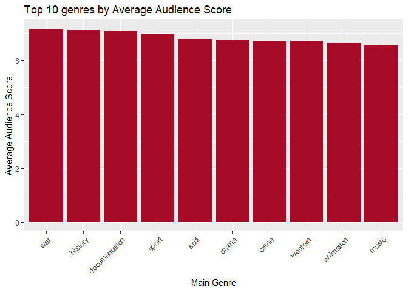

# PURPOSE:

This readme is located in my repository for the Data Science Methods for
Economics and Finance 871 Exam. The repository contains all of my code,
figures, tables, and write-ups for the exam. There are a total of 5
questions & each question has its own folder with an accompanying
Readme, code and data folder.

# SETUP CREATION:

``` r
#The '23761067' project was created by copying the file path for my repository file (C:/Users/Talyah Greyling/Documents/1) Meesters/1) Data Science 871/Data_Science_Exam_23761067_GitHub) and then using fmxdat::make_project(ProjNam = "23761067"). 

#This code was used to create the question folders: 
location <- "C:/Users/Talyah Greyling/Documents/1) Meesters/1) Data Science 871/Data_Science_Exam_23761067_GitHub"
Texevier::create_template(directory = location, template_name = "Question1")
Texevier::create_template(directory = location, template_name = "Question2")
Texevier::create_template(directory = location, template_name = "Question3")
Texevier::create_template(directory = location, template_name = "Question4")
Texevier::create_template(directory = location, template_name = "Question5")
```

# DATA STORAGE:

I unzipped the data folder provided (datsci.nfkatzke.com/PracData25.zip)
and put each data file in its respective question folder’s corresponding
data file. I then added ’\*data/’ to my gitignore to prevent the data
folders from committing to GitHub.

I also stored the ‘Practical_25.pdf’ in my bin folder.

# CODE USED FOR FIGURES AND TABLES:

``` r
# Housekeeping 
knitr::opts_chunk$set(echo = FALSE, message = FALSE, warning = FALSE, fig.width = 6, fig.height = 5, fig.pos = 'H') # set chunk defaults 
rm(list = ls()) # clear environment 
gc() # garbage collection 
```

    ##           used (Mb) gc trigger (Mb) max used (Mb)
    ## Ncells  556566 29.8    1239164 66.2   702048 37.5
    ## Vcells 1059236  8.1    8388608 64.0  1927558 14.8

``` r
options(scipen = 999) #suppress scientific notation
options(dplyr.summarise.inform=F) # suppress messages

# Load neccessary libraries 
pacman::p_load(dplyr, ggplot2, tidyverse, stringr, purrr, lubridate, gt, fmsb, hrbrthemes) ############## update 

# Source in all functions: 
list.files('Question1/code/', full.names = T, recursive = T) %>% .[grepl('.R', .)] %>% as.list() %>% walk(~source(.))
list.files('Question2/code/', full.names = T, recursive = T) %>% .[grepl('.R', .)] %>% as.list() %>% walk(~source(.))
list.files('Question3/code/', full.names = T, recursive = T) %>% .[grepl('.R', .)] %>% as.list() %>% walk(~source(.))
list.files('Question4/code/', full.names = T, recursive = T) %>% .[grepl('.R', .)] %>% as.list() %>% walk(~source(.))
list.files('Question5/code/', full.names = T, recursive = T) %>% .[grepl('.R', .)] %>% as.list() %>% walk(~source(.))
```

# QUESTION 1: Baby Names

## Load data

## Process explained

-   Created the function \*\*\* that takes \*\*\* as an input and \*\*\*
-   Created the function \*\*\* that takes \*\*\* as an input and \*\*\*
-   I decided to look at naming trends nationally for the US since this
    was in line with the clients request to start by showing a
    time-series representation of the Spearman rank-correlation between
    each year’s 25 most popular boys’ and girls’ names and that of the
    next 3 years and meant that substantial wrangling work was already
    done in this format.
-   To look at name popularity I decided to look at the top 5 nationally
    per year for boys and girls respectively, but upon time series
    visualisation saw that the persistence was too weak over the while
    time series to generate useful plots. I therefore decided to
    identify the top 10 names per decade and visualise those in a
    heatmap.
-   Lastly

### Time-series representation of the Spearman rank-correlation

-   I created a function ‘top_n_names’ that filters and ranks the baby
    names by year & gender (boys vs girls).
-   Thereafter I created a function ‘calculate_correlations’ that
    computes the Spearman Rank Correlation for a specific target year
-   Then I created a function ‘name_persistence’ that applies this
    correlation calculation to all years such that the output can be
    visually represented.
-   Lastly, the function ‘plot_name_persistence’ uses geom_smooth to fit
    a series of lines that represent the rank-correlation over time

#### Plot number 1


<p class="caption">
Persistence of National Top 25 Baby Names (1910-2014).
</p>

### Popular names

-   After this requested initial rank-correlation analysis it would be
    useful to see which names were the most popular
-   I created a function ‘top_n_names_per_decade’ that I use to
    determine to top 10 boy and girl names respectively per decade
-   I then created a function ‘popular_names_heatmap’ that generates a
    heatmap to illustrate persistance of the top 10 names in each
    decade.

#### Plot number 2


<p class="caption">
Persistence of National Top 10 Baby Names per decade (1910-2014).
</p>

### Do movies determine popular names

-   TMDB stands for The Movie Database. The percentage is a score given
    to that movie or TV show by the database users on a 10-star scale.
    This can give you an idea of how other viewers feel about the show.
-   Do people name babies after famous actors/ actresses who play
    popular movie characters? Define popular as a movie that scores
    above average on TMDB.
-   To explore this question I created a function ‘get_popular_movies’
    that determines which movies got above average TMDB scores
-   

#### Plot 3

### Issues encountered

-   I wrote a function to silently collate the rds files, but upon its
    creation saw that many of the columns then became unusable by
    containing an abundance of NAs, I decided to read in each file
    seperately by adapting the code provided in the assignment.

## Plots, graphs and tables reprinted

# QUESTION 2: Music Taste

## Load data

## Process explained

-   Created the function \*\*\* that takes \*\*\* as an input and \*\*\*
-   Created the function \*\*\* that takes \*\*\* as an input and \*\*\*

## Plots, graphs and tables reprinted

# QUESTION 3: Netflix

## Load data

## Process explained

-   Wrote a short introduction with 1 reference
-   Created the function ‘add_main_genre’ that takes ‘df_titles’ as an
    input and identifies the main genre as the first entry in df_titles
    and stores it in a new column ‘main_genre’
-   Created the function ‘counts_genre’ that takes ‘df_titles’ as an
    input and generates the genre distribution by counting the
    occurences in Netflix data
-   Created the function ‘get_top_n_genres’ that takes ‘df_titles’ and
    ‘n’ as inputs and calculates the top n genres by average audience
    score on IMDB
-   Created the function ‘draw_genre_distribution’ that takes
    ‘genre_distribution’ as an input and creates a bar plot of the
    distribution of genres on Netflix
-   Created the function ‘draw_top_n_genres’ that takes ‘top_10_genres’
    as an input and creates a bar plot of the top 10 genres by average
    audience score on IMDB
-   Created a duration data frame by combining ‘df_titles’ and
    ‘df_movies’
-   Created the function ‘get_duration_distribution’ that takes
    ‘df_duration’ as an input and generates the distribution of duration
    by summing occurrences in Netflix data in bins of 10 minutes
-   Created the function ‘get_top_n_durations’ that takes ‘df_duration’
    as an input and calculates the top n durations by average audience
    score on IMDB
-   Created the function ‘draw_duration_distribution’ that takes
    ‘duration_distribution’ as an input and creates a barplot of the
    distribution of durations on Netflix
-   Created the function ‘draw_top_n_durations’ that takes
    ‘top_10_durations’ as an input and create a bar plot of the top 10
    durations by average audience score on IMDB
-   Created the function \*\*\* that takes \*\*\* as an input and \*\*\*
-   Created the function \*\*\* that takes \*\*\* as an input and \*\*\*
-   Drew ‘genre_distribution_plot’, ‘top_n_genres_plot’,
    ‘duration_distribution_plot’ and ‘top_n_durations_plot’ (as depicted
    below)
-   Discussed my findings in a brief summary

## Plots, graphs and tables reprinted


<p class="caption">
Distribution of genres on Netflix
</p>


<p class="caption">
Top genres according to audience
</p>


<p class="caption">
Distribution of durations on Netflix
</p>


<p class="caption">
Top genres according to audience
</p>

# QUESTION 4: Billionaires

## Load data

## Process explained

-   Fixed inconsistent naming conventions in billionaires.csv
-   Added a column ‘Automatic Type’ to Info file.xlsx
-   Read through StackOverflow thread to resolve read_csv issue: decided
    to set the default column type as character & adjust the necessary
    columns to double and integer.
-   Created the function ‘read_csv_with_col_type’ that takes ‘csv_file’
    as an input and then reads in a CSV document with its specific
    column types
-   Wrote the introduction with 2 references  
-   Wrote the exploration goals
-   Created the functions ‘counts_new_us’ and ‘counts_new_other’ which
    take the data frame ‘df_billions’ as input and counts the amount of
    new billionaires & billionaires by inheritance per decade in the US
    and other countries respectively
-   Created the function ‘draw_first_claim’ that takes ‘df_us_billions’
    and ‘input_title’ as inputs to create a grouped bar chart of the
    counts of new vs. inherited wealth per decade
-   Drew ‘us_plot_first_claim’ (as depicted below) and discussed my
    findings
-   Drew ‘other_plot_first_claim’ (as depicted below) and discussed my
    findings
-   Created the function ‘counts_software’ that takes ‘df_billions’ and
    ‘software_words’ as inputs to count the amount of new billionaires
    through software vs. consumer services (per decade)
-   Created the function ‘draw_second_claim_software’ that takes
    ‘df_software_billions’ as an input to create a lollipop plot of the
    amount of new billionaires through software vs. consumer services
    (per decade)
-   Drew ‘draw_second_claim_software’ (as depicted below) and discussed
    my findings
-   Wrote the conclusion

## Plots, graphs and tables reprinted


<p class="caption">
New vs. inherited wealth per decade (US)
</p>


<p class="caption">
New vs. inherited wealth per decade (other countries)
</p>


<p class="caption">
New Billionaires from Software vs Consumer Services (per decade)
</p>

# QUESTION 5: Health

## Process explained

-   Read the question at 1am & thought it looked really nice
-   Decided to use my remaining hours to iron out issues in my previous
    questions

## Plots, graphs and tables reprinted
